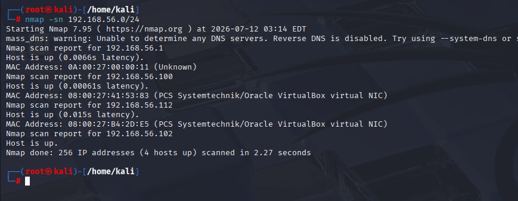
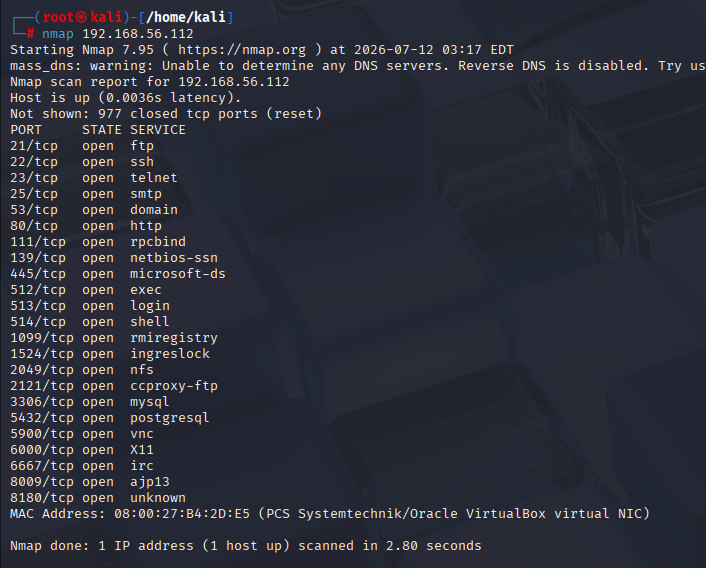
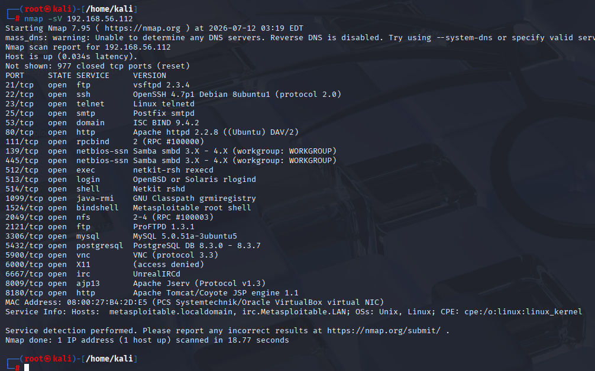
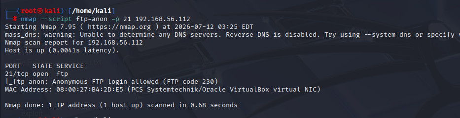
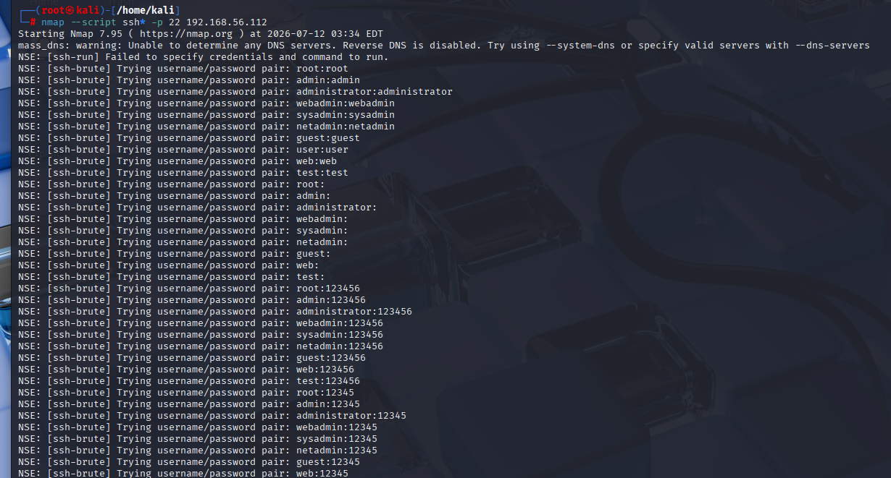
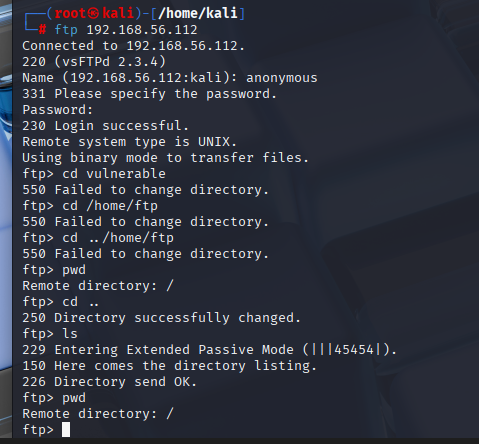
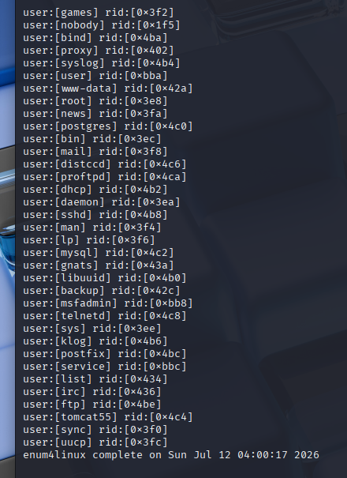
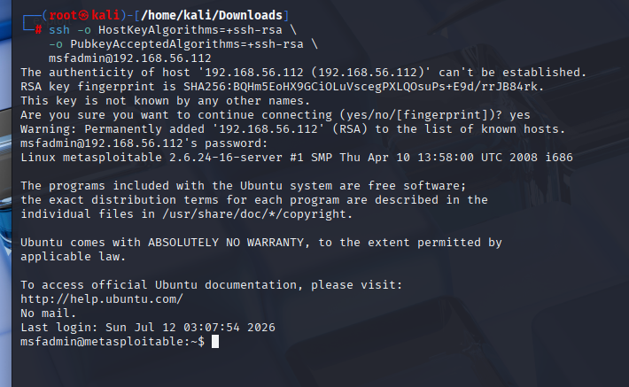
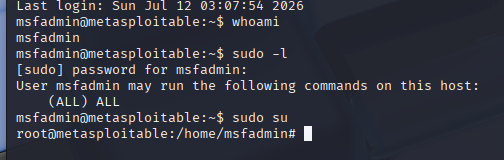

# metasploitable_writeup

**Author:** Sagnik Ray  
**Date:** 2026-07-12  

## Overview

Metasploitable 2 is a deliberately vulnerable Linux virtual machine designed for cybersecurity training and penetration testing. It contains numerous intentionally insecure services and applications, providing a safe environment to practice vulnerability assessment, exploitation, and post-exploitation techniques in an isolated lab.

## Objective

- To identify vulnerabilities and misconfigurations present in the Metasploitable 2 virtual machine.

- To perform penetration testing in a safe and controlled laboratory environment.

- To understand the exploitation process and strengthen practical cybersecurity skills through hands-on analysis.

## Lab Setup & Tools

- Virtualization Platform: Oracle VirtualBox

- Network Mode: Host-Only Adapter

- Attacker Machine: Kali Linux (192.168.56.102)

- Victim Machine: Metasploitable2 (192.168.56.112)

- Tools Used: nmap, metasploit , netcat

## Discovery

- Performing Network discovery via ping sweep over the subnet to check host ips and its status

## Reconnaissance

- Using nmap to check for open ports

- Grabbing port versions using -sV

## Enumeration

- Narrowing down to specific ports for targeted enumeration

- Port21: Checking for anonoymous login.

- Port 22: Enumerating ssh to know auth types, intrusive brute force allowance.

- Found nothing useful in FTP directory

- Enumerating available users in the machine via SMB enumeration using enum4linux

- SSH Connect Attempt: Trying msfadmin:msfadmin user/password combination against ssh

## Exploitation

- Privilege Escalation via msfadmin password

## Findings

- Anonymous FTP login was enabled, allowing unauthorized access without authentication.
- Multiple unnecessary ports and services were exposed, increasing the system's attack surface.
- SMB enumeration using enum4linux revealed valid usernames, facilitating further attacks.
- SSH credentials were weak, with the password identical to the username.
- SSH password-based authentication was enabled, making the service susceptible to password attacks.
- SSH lacked restrictions on authentication attempts, allowing brute-force login attempts.
- The combination of exposed services and weak authentication increased the overall risk of unauthorized system access.

## System Hardening

- Disable anonymous FTP access and allow only authenticated users.
- Close or disable unnecessary ports and services to reduce the attack surface.
- Restrict SMB enumeration by disabling null sessions and limiting anonymous access.
- Enforce a strong password policy with complex, unique passwords.
- Disable SSH password authentication and use SSH key-based authentication.
- Configure SSH login restrictions (e.g., MaxAuthTries) and enable account lockout or rate limiting.
- Deploy intrusion prevention mechanisms such as Fail2Ban to mitigate brute-force attacks.
- Apply the principle of least privilege by limiting user permissions and access.
- Segragate root and non-root accounts by using different passwords.

---
_Generated by Writify v2.0.0 - 2026-07-12T08.17.07Z_
